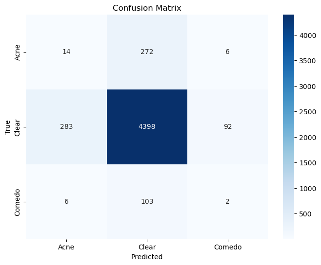

# [Skincareku](https://github.com/AlvonJ/skincareku-project)

# Image Classification on Face Dataset

This repository includes code for training and evaluating an image classification model on a face dataset using TensorFlow and MobileNetV2. The dataset consists of images categorized into three classes: acne, comedo, and clear skin.

## Dataset

The face dataset used in this project is available on Kaggle. It consists of images categorized into three classes: Acne, Comedo, and Clear Skin. The dataset is divided into a training set and a validation set.

To access the dataset, follow these steps:

1. Download the dataset from Kaggle: [Link to Kaggle Dataset](https://www.kaggle.com/datasets/xtvgie/face-datasets)

2. Extract the dataset files into the following directories:

   - Training images: `./face-dataset/train`
   - Validation images: `./face-dataset/validation`

## Model Architecture

The model architecture used for image classification is based on MobileNetV2, a popular deep learning model for mobile and embedded vision applications. The pre-trained MobileNet model is used as the base model, and additional layers are added for classification.

The key steps of the model building process include:
- Loading and preprocessing the dataset using `ImageDataGenerator`.
- Setting up the MobileNet model with pre-trained weights.
- Freezing the pre-trained layers and adding new layers for classification.
- Compiling the model with appropriate loss function, optimizer, and metrics.
- Training the model on the training dataset.
- Evaluating the model on the validation dataset.

## Results

The model achieves the following performance metrics on the validation set:

- Accuracy: 85.28%
- Precision: 85.27%
- Recall: 85.28%
- F1-Score: 85.28%

A confusion matrix is plotted to visualize the model's performance on different classes.



## Model Export

The trained model can be exported and saved in TensorFlow Lite format for deployment on resource-constrained devices. To save the model in TensorFlow Lite format, follow these steps:

1. After training the model, use the following code snippet to save it in TensorFlow SavedModel format:

   ```python
   model.save("face_classification_model")

2. Convert the SavedModel to TensorFlow Lite format using the TensorFlow Lite Converter:

   ```python
   tensorflow_lite_converter --saved_model_dir=face_classification_model --output_file=face_classification_model.tflite

The resulting .tflite file can be used for inference on mobile or embedded devices.

## Usage

1. To run the code locally or reproduce the results, follow these steps:

   ```python
   git clone https://github.com/your-username/image-classification-face.git

2. Install the required dependencies.

3. Place the extracted dataset files in the appropriate directories:

Training images: ./face-dataset/train
Validation images: ./face-dataset/validation

4. Update the paths to the training and validation directories in the notebook.

5. Run the notebook image_classification_face.ipynb to train the model and evaluate its performance.
